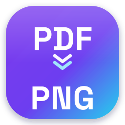

<div align="center">



# PDF&nbsp;→&nbsp;PNG

**Convert every page of a PDF into its own PNG image — free, private, and right in your browser.**

[](https://github.com/simeontsvetanov/pdf-to-png/actions/workflows/ci.yml)
[](https://github.com/simeontsvetanov/pdf-to-png/actions/workflows/deploy.yml)
[](./LICENSE)

[**Open the app →**](https://simeontsvetanov.github.io/pdf-to-png/) · [Buy me a coffee ☕](https://buymeacoffee.com/simeontsvetanov)

</div>

---

## ✨ Features

- **PDF → PNG, one image per page.** Drop a PDF, get crisp PNGs.
- **Download individually or all at once** as a ZIP archive.
- **Quality / scale control (0.1–1.0)** — `1.0` is full quality; lower is smaller and faster.
- **100% private.** Everything runs locally; your files never leave your device.
- **Installable PWA.** Add it to your home screen / desktop and use it **offline**.
- **Light / Dark / System** themes with a contrasting, modern design.
- **No accounts, no tracking, no ads.**
- **Client-side "service" mode** — drive it from other apps via URL params or an iframe.

## 🚀 Quick start

```bash
npm install      # install dependencies
npm run dev      # start the dev server
npm run build    # produce a static build in dist/
npm run preview  # preview the production build
```

### Useful scripts

| Script | What it does |
|--------|--------------|
| `npm run dev` | Vite dev server with HMR |
| `npm run build` | Type-check + production build to `dist/` |
| `npm run lint` | ESLint over the project |
| `npm run typecheck` | TypeScript, no emit |
| `npm run test` | Unit & component tests (Vitest) |
| `npm run test:coverage` | Tests with coverage |
| `npm run test:e2e` | Playwright end-to-end tests (optional) |
| `npm run format` | Prettier write |

## 🧱 Tech stack

**Vite** · **React 19** · **TypeScript (strict)** · **Tailwind CSS v4** · **shadcn-style UI on Radix** ·
**pdf.js** (`pdfjs-dist`) · **vite-plugin-pwa / Workbox** · **JSZip** · self-hosted **Space Grotesk + Inter**.

See [`reports/`](./reports) for the full research and rationale, and
[`design/`](./design) for the design system (tokens + logo).

## 🛰️ Service mode (no backend required)

GitHub Pages is static, so the "service" runs in the browser. Pre-load and convert
a PDF via URL parameters:

```
https://simeontsvetanov.github.io/pdf-to-png/?url=<PDF_URL>&scale=0.75&autodownload=zip
```

| Param | Values | Default | Meaning |
|-------|--------|---------|---------|
| `url` | encoded PDF URL | — | Remote PDF to fetch & convert (CORS permitting) |
| `scale` | `0.1`–`1.0` | `1.0` | Render quality |
| `page` | `n`, `a-b`, `all` | `all` | Which pages |
| `autodownload` | `zip` \| `each` \| `off` | `off` | Auto-download behavior |
| `embed` | `1` | `0` | Hide chrome for clean iframe embedding |

**Embed via iframe + `postMessage`:**

```js
const frame = document.querySelector("iframe");
window.addEventListener("message", (e) => {
  if (e.data?.type === "pdf2png:ready") {
    frame.contentWindow.postMessage(
      { type: "pdf2png:convert", url: "https://example.com/file.pdf", scale: 0.75 },
      "*",
    );
  }
  if (e.data?.type === "pdf2png:result") console.log(e.data.pages); // [{ index, dataUrl, width, height }]
});
```

Full contract: [`reports/04-microservice-client-side.md`](./reports/04-microservice-client-side.md).

### Server-to-server API (n8n, backends)

Server tools have no browser, so they can’t use the modes above. An **optional**,
free HTTP API lives in [`service/`](./service) (Hono + MuPDF, deploys to Cloudflare
Workers or any Node host): `POST /info`, `POST /page`, `POST /convert`. It includes
ready-to-paste **n8n** examples, including a page-by-page loop that avoids timeouts
on large PDFs. See [`service/README.md`](./service/README.md). The same docs are in
the app under **menu → Use as a service**.

## 🌐 Deployment (GitHub Pages)

1. Push to `main`. The [deploy workflow](./.github/workflows/deploy.yml) builds and publishes automatically.
2. In the repo: **Settings → Pages → Build and deployment → Source: GitHub Actions**.
3. `vite.config.ts` `base` must match the repo name (`/pdf-to-png/`).

## 🎨 Design principles

- **No borders** — separation comes from elevation (shadow) and subtle tints.
- **Hover = a soft shadow lift.**
- **Contrasting light/dark themes**, electric **violet + cyan** accents (OKLCH).
- Every color/space/radius/shadow is a **design token** (`design/tokens.css`).

## 🔒 Privacy

No uploads. No servers. No analytics. Your documents are processed entirely on your
device. See [Terms &amp; Conditions](./TERMS.md).

## 🤝 Credits

Built by **Simeon "Moni" Tsvetanov** · ✉️ tsvetanov.simeon@gmail.com ·
☕ [Buy me a coffee](https://buymeacoffee.com/simeontsvetanov)

Licensed under the [MIT License](./LICENSE).
